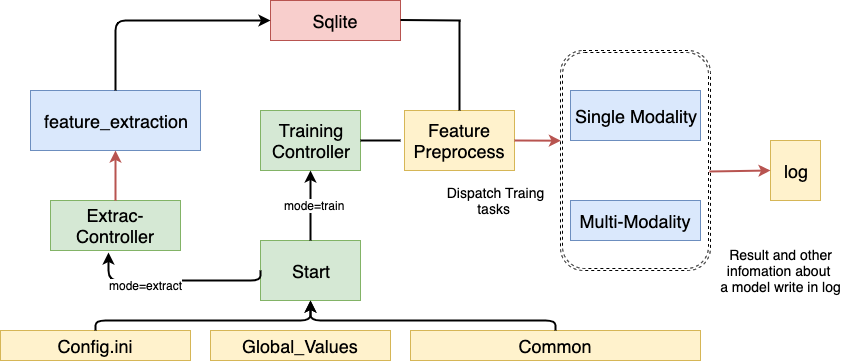

# dds-avec2019
Detect Depression Sub-challenge of AVEC2019 

Giving that I need many different type experiments, I made a relatively dispert framework

## 结构


### feature_extraction

Different features' extraction according to each model;

- example_1: from [paper]()

- example_2: Audio Only, 简单使用COVAREP各项的统计特征。

- baseline19: from [AVEC2019]()


### predictor

Models (Unimodal or Multi-modal fusion)

- rf 简易随机森林模型

### 其他
例如
- common 共用工具（统计特征计算、日志配置、数据库接口、其他IO处理接口等）
- config 配置项

## 使用
此版本基于`python3.7` 如果期望使用以下版本运行只需修改全部的`f-string`即可；


安装需求库
```
pip install -r requirements.txt
```

根据你的环境， 修改`config.ini.model`文件的全部 和 `global_values.py`的部分参数，当然扩展模型时也可以加入新的参数；

运行实验，输入可选参数
```
python start.py --mode [train|extract] --model [MODEL_NAME] --feature [FEATURE_NAME]
```
参数解释

- `mode` 运行模式，目前支持 train(训练)、 extract（特征提取）
- `model` 选择以哪个模型训练
- `feature` 选择以哪种特征训练

以上列表均支持传入列表，支持同时训练，结果都会打印在日志中；

- 特征提取

本框架同意采用sqlite存储特征文件，根据不同模型的特征需求、提取方法不同，需要先进行提取入库；

例如：
提取exp1模型的特征，*(暂未实现按模态提取，未来可以考虑加入）*
```bash
 python3 start.py  --mode extract --feature exp1 
```

- 预测实验
在实验之前你可能需要把实验的数据集（训练集和测试集）也做入库处理，保持前后的统一：
```
python core/feature_extraction/data_to_db.py
```


示例：
```
python3 start.py --mode train --model rf --feature exp2
```
输出：
```
'2019-12-15 17:51:05,607 - root - INFO - Init!..'
'2019-12-15 17:51:05,609 - root - INFO - You are training using model rf via feature exp2'
'2019-12-15 17:51:05,942 - root - INFO - You are training using model rf via feature exp2 and consider gender!'
'2019-12-15 17:51:54,892 - root - INFO - Evalutaion Scores Male rf with exp2: {'MAE': 4.102095238095239, 'RMSE': 5.153005734058336, 'CCC': 0.8928171981046186}'
'2019-12-15 17:51:54,922 - root - INFO - Evalutaion Scores rf with exp2: {'MAE': 5.709, 'RMSE': 6.829644695492341, 'CCC': 0.0043751856763118175}'
'2019-12-15 17:52:25,815 - root - INFO - Evalutaion Scores Female rf with exp2: {'MAE': 5.230599999999999, 'RMSE': 6.464858815163716, 'CCC': 0.9062228977199308}'
```


## 数据库

太多了不想写，使用的sqlite, 有空了导出个sql

## TODO

- 更多的训练模型和特征模型

- 深度模型加入后框架的调整
